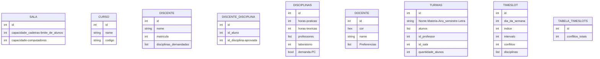

# DER

```mermaid
erDiagram
    SALA {
        int id
        int capacidade_cadeiras-limite_de_alunos
        int capacidade-computadores
    }
    CURSO {
        int id
        string name
        string codigo
    }
    DISCENTE {
        int id
        string nome
        int matricula
        list disciplinas_demandadas
    }
    DISCENTE_DISCIPLINA {
        int id
        int id_aluno
        int id_disciplina-aprovada
    }
    DISCIPLINAS {
        int id
        int horas-praticas
        int horas-teoricas
        list professores
        int laboratorio
        bool demanda-PC
    }
    DOCENTE {
        int id
        hex cor
        string name
        list Preferencias
    }
    TURMAS {
        int id
        string Nome-Materia-Ano_semestre-Letra
        list alunos
        int id_professor
        int id_sala
        int quantidade_alunos
    }
    TIMESLOT {
        int id
        int dia_da_semana
        int indice
        int intervalo
        int conflitos
        list disciplinas
    }
    TABELA_TIMESLOTS {
        int id
        int conflitos_totais
    }
```

<!-- COURSE ||--|{ TEACHER : "is taught by"
COURSE ||--|{ ROOM : "is scheduled in"
COURSE ||--o{ STUDENT : "is taken by"
COURSE ||--|{ TIMESLOT : "is scheduled at" -->
